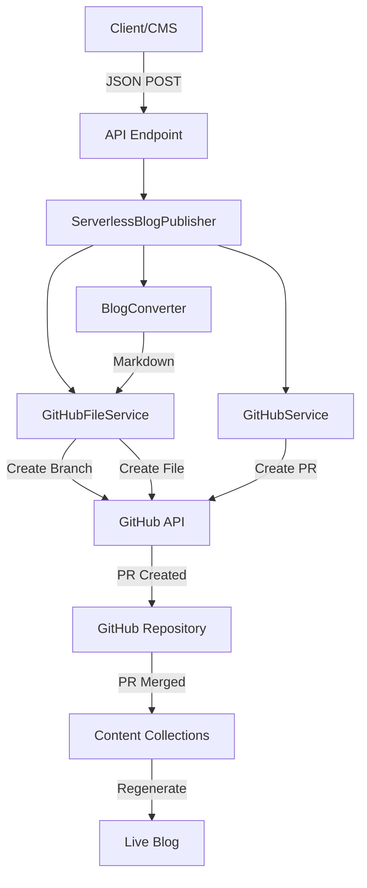

## System Architecture

The Blog Publishing System is designed as a serverless-first application that works perfectly on platforms like Vercel, Netlify, and other edge deployments.



## Core Components

<CardGroup cols={2}>
  <Card title="API Endpoint" icon="plug">
    Entry point for blog publishing requests
  </Card>
  <Card title="Blog Converter" icon="file-code">
    Converts JSON to Markdown with frontmatter
  </Card>
  <Card title="GitHub File Service" icon="folder">
    Handles file operations via GitHub API
  </Card>
  <Card title="GitHub Service" icon="code-pull-request">
    Manages Pull Requests and reviews
  </Card>
</CardGroup>

## Serverless Design

<Tabs>
  <Tab title="Why Serverless?">
    The system is designed to work in serverless environments where:
    
    - **No persistent file system** - Files can't be saved locally
    - **No git CLI** - Can't run git commands
    - **Stateless functions** - Each request is independent
    - **Auto-scaling** - Handles any number of requests
    - **Cost-effective** - Pay only for what you use
  </Tab>
  
  <Tab title="GitHub API Approach">
    Instead of local git operations, we use GitHub's REST API:
    
    - **Create branches** via API
    - **Create/update files** via API
    - **Commit changes** via API
    - **Create pull requests** via API
    - **Add labels and reviewers** via API
    
    All operations are done remotely with no local state.
  </Tab>
  
  <Tab title="Benefits">
    - ✅ Works on any serverless platform
    - ✅ No build-time dependencies
    - ✅ Instant scaling
    - ✅ No infrastructure management
    - ✅ Global edge deployment
    - ✅ Automatic HTTPS
  </Tab>
</Tabs>

## Request Flow

<Steps>
  <Step title="Client Sends Request">
    A client (CMS, script, or manual request) sends JSON blog data to `/api/publish-blog`
  </Step>
  
  <Step title="Validation">
    The API endpoint validates:
    - Environment variables are set
    - Request body is valid JSON
    - Required blog fields are present
    - Blog data matches schema
  </Step>
  
  <Step title="Conversion">
    `BlogConverter` service:
    - Generates slug from title
    - Converts JSON to Markdown
    - Adds YAML frontmatter
    - Formats content
  </Step>
  
  <Step title="Branch Creation">
    `GitHubFileService` via GitHub API:
    - Gets current main branch SHA
    - Creates new branch with unique name
    - Returns branch reference
  </Step>
  
  <Step title="File Creation">
    `GitHubFileService` via GitHub API:
    - Encodes content to base64
    - Creates file in new branch
    - Commits with descriptive message
  </Step>
  
  <Step title="Pull Request">
    `GitHubService` via GitHub API:
    - Creates PR from new branch to main
    - Adds descriptive title and body
    - Adds labels (if specified)
    - Assigns reviewers (if specified)
  </Step>
  
  <Step title="Response">
    API returns:
    - Success/failure status
    - PR URL and number
    - Branch name
    - Blog slug
    - Any errors
  </Step>
</Steps>

## Data Flow

```
┌─────────────┐
│ JSON Input  │
└──────┬──────┘
       │
       ▼
┌─────────────────────┐
│ BlogInput Interface │
│ - title             │
│ - description       │
│ - author            │
│ - date              │
│ - content           │
│ - published         │
└──────┬──────────────┘
       │
       ▼
┌─────────────────────┐
│ Markdown with       │
│ Frontmatter         │
│                     │
│ ---                 │
│ title: "..."        │
│ description: "..."  │
│ ---                 │
│                     │
│ # Content...        │
└──────┬──────────────┘
       │
       ▼
┌─────────────────────┐
│ GitHub Repository   │
│ content/posts/      │
│ └── slug.md         │
└──────┬──────────────┘
       │
       ▼
┌─────────────────────┐
│ Content Collections │
│ Auto-regenerates    │
└──────┬──────────────┘
       │
       ▼
┌─────────────────────┐
│ Live Blog Post      │
│ /blog/slug          │
└─────────────────────┘
```

## Scalability

<AccordionGroup>
  <Accordion title="Concurrent Requests">
    The serverless architecture automatically scales to handle multiple concurrent blog publishing requests. Each request runs in its own isolated function instance.
  </Accordion>
  
  <Accordion title="GitHub API Rate Limits">
    - **Authenticated**: 5,000 requests per hour
    - **Per-repository**: Secondary rate limits apply
    - **Recommendation**: Add delays between bulk operations
    
    The system includes automatic retry logic and error handling for rate limits.
  </Accordion>
  
  <Accordion title="Performance Optimization">
    - Minimal cold start time
    - Efficient GitHub API usage
    - Batch operations for multiple blogs
    - Cached authentication tokens
    - Parallel API calls where possible
  </Accordion>
</AccordionGroup>

## Security

<CardGroup cols={2}>
  <Card title="Environment Variables" icon="lock">
    Sensitive data stored in encrypted environment variables
  </Card>
  <Card title="GitHub Token" icon="key">
    Fine-grained permissions with repo access only
  </Card>
  <Card title="API Authentication" icon="shield">
    Optional bearer token authentication
  </Card>
  <Card title="HTTPS Only" icon="shield-check">
    All communications encrypted in transit
  </Card>
</CardGroup>

## Error Handling

The system implements comprehensive error handling at every level:

<Tabs>
  <Tab title="API Level">
    - Missing environment variables
    - Invalid request format
    - Missing required fields
    - Authentication failures
  </Tab>
  
  <Tab title="Service Level">
    - GitHub API errors
    - Network timeouts
    - Rate limiting
    - Branch conflicts
    - File creation failures
  </Tab>
  
  <Tab title="Response">
    Detailed error messages:
    ```json
    {
      "success": false,
      "error": "Failed to create branch: Branch already exists",
      "message": "Failed to publish blog post"
    }
    ```
  </Tab>
</Tabs>

## Next Steps

<CardGroup cols={2}>
  <Card title="Services Deep Dive" icon="gears" href="/architecture/services">
    Explore each service in detail
  </Card>
  <Card title="Workflow" icon="diagram-project" href="/architecture/workflow">
    Understand the complete workflow
  </Card>
</CardGroup>

