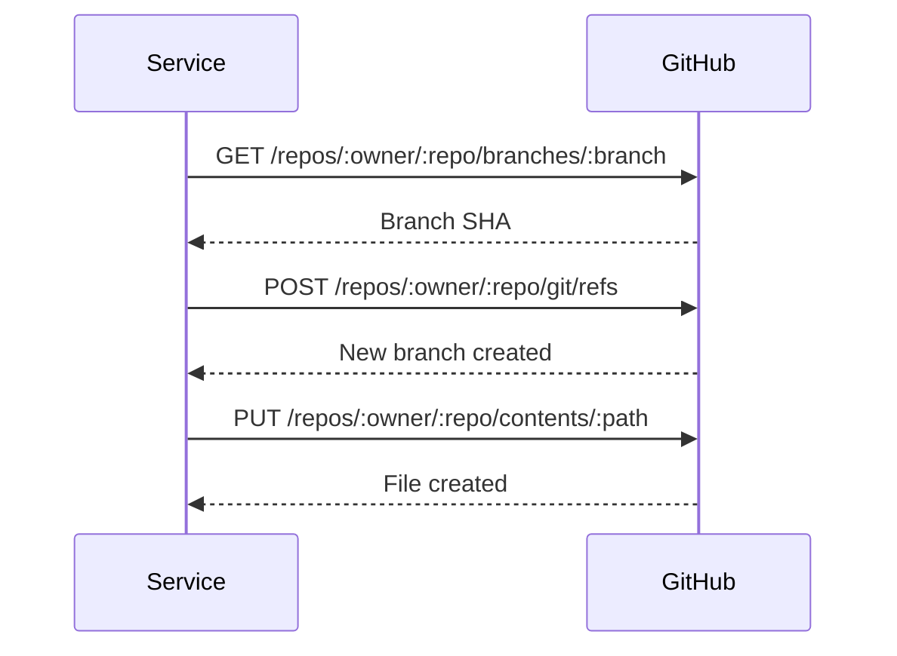

## Service Architecture

The system is composed of modular, single-responsibility services that work together to publish blog posts.

## BlogConverter Service

Handles the conversion of JSON blog data to Markdown format with YAML frontmatter.

### Location
```
src/lib/services/blog-converter.ts
```

### Key Functions

<CodeGroup>

```typescript convertJsonToMarkdown
export function convertJsonToMarkdown(blog: BlogInput): string {
  const frontmatter = [
    '---',
    `title: "${blog.title}"`,
    `description: "${blog.description}"`,
    `author: "${blog.author}"`,
    `date: "${blog.date}"`,
    `published: ${blog.published ?? true}`,
    '---',
    '',
  ].join('\n');

  return frontmatter + blog.content;
}
```

```typescript generateSlug
export function generateSlug(title: string): string {
  return title
    .toLowerCase()
    .replace(/[^\w\s-]/g, '')
    .replace(/\s+/g, '-')
    .replace(/-+/g, '-')
    .trim();
}
```

```typescript validateBlogInput
export function validateBlogInput(blog: any): blog is BlogInput {
  return (
    typeof blog.title === 'string' &&
    typeof blog.description === 'string' &&
    typeof blog.author === 'string' &&
    typeof blog.date === 'string' &&
    typeof blog.content === 'string'
  );
}
```

</CodeGroup>

### Responsibilities
- Convert JSON to Markdown
- Generate URL-friendly slugs
- Validate blog input data
- Format frontmatter

---

## GitHubFileService

Manages file operations in GitHub repositories via the REST API.

### Location
```
src/lib/services/github-file-service.ts
```

### Key Methods

<AccordionGroup>
  <Accordion title="getBranchSHA">
    Gets the SHA of the latest commit on a branch
    
    ```typescript
    async getBranchSHA(branch: string = 'main'): Promise<string>
    ```
    
    - Tries 'main' first, falls back to 'master'
    - Returns commit SHA for branch creation
  </Accordion>
  
  <Accordion title="createBranch">
    Creates a new branch from a base branch
    
    ```typescript
    async createBranch(
      branchName: string,
      baseBranch: string = 'main'
    ): Promise<CreateBranchResult>
    ```
    
    - Gets base branch SHA
    - Creates new branch reference
    - Returns branch name and SHA
  </Accordion>
  
  <Accordion title="createOrUpdateFile">
    Creates or updates a file in the repository
    
    ```typescript
    async createOrUpdateFile(
      path: string,
      content: string,
      message: string,
      branch: string
    ): Promise<void>
    ```
    
    - Encodes content to base64
    - Checks if file exists
    - Creates or updates accordingly
  </Accordion>
  
  <Accordion title="createMultipleFiles">
    Creates multiple files in a single commit
    
    ```typescript
    async createMultipleFiles(
      files: FileContent[],
      branch: string,
      commitMessage: string
    ): Promise<void>
    ```
    
    - Creates blobs for each file
    - Creates tree structure
    - Commits all files at once
    - More efficient for batch operations
  </Accordion>
</AccordionGroup>

### API Workflow



---

## GitHubService

Manages Pull Requests, labels, and reviewers via the GitHub API.

### Location
```
src/lib/services/github-service.ts
```

### Key Methods

<Tabs>
  <Tab title="createPullRequest">
    Creates a pull request from one branch to another
    
    ```typescript
    async createPullRequest(options: PullRequestOptions): Promise<any> {
      const response = await this.octokit.pulls.create({
        owner: this.owner,
        repo: this.repo,
        title: options.title,
        body: options.body,
        head: options.head,
        base: options.base || 'main',
      });
      
      return {
        number: response.data.number,
        url: response.data.html_url,
        title: response.data.title,
      };
    }
    ```
  </Tab>
  
  <Tab title="addLabels">
    Adds labels to a pull request
    
    ```typescript
    async addLabels(prNumber: number, labels: string[]): Promise<void> {
      await this.octokit.issues.addLabels({
        owner: this.owner,
        repo: this.repo,
        issue_number: prNumber,
        labels,
      });
    }
    ```
  </Tab>
  
  <Tab title="addReviewers">
    Assigns reviewers to a pull request
    
    ```typescript
    async addReviewers(
      prNumber: number,
      reviewers: string[],
      teamReviewers?: string[]
    ): Promise<void> {
      await this.octokit.pulls.requestReviewers({
        owner: this.owner,
        repo: this.repo,
        pull_number: prNumber,
        reviewers,
        team_reviewers: teamReviewers,
      });
    }
    ```
  </Tab>
</Tabs>

---

## ServerlessBlogPublisher

The main orchestrator that coordinates all services to publish blogs.

### Location
```
src/lib/services/serverless-blog-publisher.ts
```

### Publishing Modes

<CardGroup cols={2}>
  <Card title="Separate Mode" icon="code-branch">
    Each blog gets its own branch and PR
  </Card>
  <Card title="Batch Mode" icon="layer-group">
    All blogs in one branch and single PR
  </Card>
</CardGroup>

### Key Methods

<AccordionGroup>
  <Accordion title="publishBlog">
    Publishes a single blog post
    
    **Steps:**
    1. Generate slug from title
    2. Convert JSON to Markdown
    3. Create unique branch
    4. Create file via GitHub API
    5. Create Pull Request
    6. Add labels and reviewers
    
    **Returns:** `PublishResult` with PR details
  </Accordion>
  
  <Accordion title="publishMultipleBlogs">
    Publishes multiple blogs (separate PRs)
    
    **Steps:**
    1. Iterate through blogs
    2. Publish each individually
    3. Add 1-second delay between requests
    4. Return array of results
    
    **Use case:** Different authors, different review cycles
  </Accordion>
  
  <Accordion title="publishMultipleBlogsInSinglePR">
    Publishes multiple blogs in one PR
    
    **Steps:**
    1. Create single branch
    2. Prepare all markdown files
    3. Create all files in one commit
    4. Create single PR for all blogs
    5. Add labels and reviewers
    
    **Use case:** Batch imports, related content
  </Accordion>
</AccordionGroup>

### Complete Flow Example

```typescript
const publisher = new ServerlessBlogPublisher(
  process.env.GITHUB_TOKEN!,
  'username',
  'my-app'
);

const result = await publisher.publishBlog(
  {
    title: "My Blog Post",
    description: "Description",
    author: "John Doe",
    date: "2025-10-17",
    content: "# Content..."
  },
  {
    labels: ['blog', 'automated'],
    reviewers: ['editor']
  }
);

console.log(result.prUrl); // PR URL
```

## Service Dependencies

```mermaid
graph TD
    A[ServerlessBlogPublisher] --> B[BlogConverter]
    A --> C[GitHubFileService]
    A --> D[GitHubService]
    C --> E[@octokit/rest]
    D --> E
```

<Note>
  All services are dependency-injected and can be used independently or together.
</Note>

## Testing Services

Each service can be tested independently:

```typescript
// Test BlogConverter
import { convertJsonToMarkdown, generateSlug } from './blog-converter';

const markdown = convertJsonToMarkdown({
  title: "Test Post",
  description: "Test",
  author: "Tester",
  date: "2025-10-17",
  content: "# Test"
});

const slug = generateSlug("Hello World Test!");
// Output: "hello-world-test"
```

## Next Steps

<CardGroup cols={2}>
  <Card title="Workflow" icon="diagram-project" href="/architecture/workflow">
    See how services work together
  </Card>
  <Card title="API Reference" icon="code" href="/api-reference/publish-blog">
    Use the API endpoint
  </Card>
</CardGroup>

