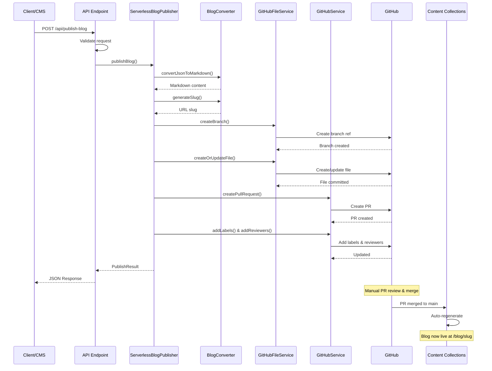
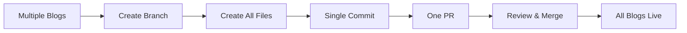

## Publishing Workflow

This page provides a detailed walkthrough of what happens when you publish a blog post.

## Overview Diagram



## Step-by-Step Process

### Step 1: Client Request

<Steps>
  <Step title="Prepare Blog Data">
    The client (CMS, script, or manual) prepares blog data in JSON format:
    
    ```json
    {
      "blogs": [{
        "title": "My Awesome Blog Post",
        "description": "A great post about something",
        "author": "Jane Doe",
        "date": "2025-10-17",
        "content": "# My Awesome Blog Post\n\nContent here..."
      }]
    }
    ```
  </Step>
  
  <Step title="Send POST Request">
    Send to the API endpoint:
    
    ```bash
    POST https://your-app.vercel.app/api/publish-blog
    Content-Type: application/json
    ```
  </Step>
</Steps>

### Step 2: API Validation

The API endpoint performs several validation checks:

<AccordionGroup>
  <Accordion title="Environment Variables Check">
    ```typescript
    if (!githubToken || !githubOwner || !githubRepo) {
      return NextResponse.json(
        { error: 'Missing required environment variables' },
        { status: 500 }
      );
    }
    ```
    
    Ensures all required GitHub configuration is present.
  </Accordion>
  
  <Accordion title="Request Body Validation">
    ```typescript
    if (!body.blogs || !Array.isArray(body.blogs)) {
      return NextResponse.json(
        { error: 'Invalid request: blogs array required' },
        { status: 400 }
      );
    }
    ```
    
    Validates the request structure.
  </Accordion>
  
  <Accordion title="Blog Data Validation">
    ```typescript
    for (const blog of body.blogs) {
      if (!validateBlogInput(blog)) {
        return NextResponse.json(
          { error: 'Invalid blog data' },
          { status: 400 }
        );
      }
    }
    ```
    
    Validates each blog post has required fields.
  </Accordion>
</AccordionGroup>

<Check>If all validations pass, proceed to publishing</Check>

### Step 3: Blog Conversion

```typescript
// Generate URL-friendly slug
const slug = generateSlug("My Awesome Blog Post");
// Result: "my-awesome-blog-post"

// Convert to Markdown with frontmatter
const markdown = convertJsonToMarkdown(blog);
```

**Output:**
```markdown
---
title: "My Awesome Blog Post"
description: "A great post about something"
author: "Jane Doe"
date: "2025-10-17"
published: true
---

# My Awesome Blog Post

Content here...
```

### Step 4: Branch Creation

<Tabs>
  <Tab title="Get Base Branch SHA">
    ```typescript
    // Get the SHA of the main branch
    const { data } = await octokit.repos.getBranch({
      owner: 'username',
      repo: 'my-app',
      branch: 'main'
    });
    
    const baseSha = data.commit.sha;
    ```
  </Tab>
  
  <Tab title="Create New Branch">
    ```typescript
    // Create unique branch name
    const branchName = `blog/my-awesome-blog-post-1729180800000`;
    
    // Create branch from main
    await octokit.git.createRef({
      owner: 'username',
      repo: 'my-app',
      ref: `refs/heads/${branchName}`,
      sha: baseSha
    });
    ```
  </Tab>
</Tabs>

### Step 5: File Creation

The markdown file is created in the new branch:

```typescript
// File path
const filePath = 'content/posts/my-awesome-blog-post.md';

// Encode content to base64
const contentEncoded = Buffer.from(markdownContent).toString('base64');

// Create file in GitHub
await octokit.repos.createOrUpdateFileContents({
  owner: 'username',
  repo: 'my-app',
  path: filePath,
  message: 'feat: Add new blog post "My Awesome Blog Post"',
  content: contentEncoded,
  branch: branchName
});
```

<Note>
  The file is created directly in GitHub - no local file system is used. This makes it perfect for serverless environments.
</Note>

### Step 6: Pull Request Creation

```typescript
const pr = await octokit.pulls.create({
  owner: 'username',
  repo: 'my-app',
  title: '📝 New Blog Post: My Awesome Blog Post',
  body: `
## 📝 New Blog Post

**Title:** My Awesome Blog Post
**Author:** Jane Doe
**Date:** 2025-10-17
**Slug:** my-awesome-blog-post

### Description
A great post about something

### Preview
This PR adds a new blog post to the content collection.
The post will be available at \`/blog/my-awesome-blog-post\` once merged.
  `,
  head: branchName,
  base: 'main'
});
```

**Result:**
- PR Number: #123
- PR URL: `https://github.com/username/my-app/pull/123`

### Step 7: Add Labels & Reviewers

<CodeGroup>

```typescript Add Labels
if (options?.labels) {
  await octokit.issues.addLabels({
    owner: 'username',
    repo: 'my-app',
    issue_number: prNumber,
    labels: ['blog', 'automated', 'content']
  });
}
```

```typescript Add Reviewers
if (options?.reviewers) {
  await octokit.pulls.requestReviewers({
    owner: 'username',
    repo: 'my-app',
    pull_number: prNumber,
    reviewers: ['editor', 'content-manager']
  });
}
```

</CodeGroup>

### Step 8: API Response

The API returns a detailed response:

```json
{
  "success": true,
  "results": [{
    "success": true,
    "message": "Blog post published successfully",
    "slug": "my-awesome-blog-post",
    "branchName": "blog/my-awesome-blog-post-1729180800000",
    "prUrl": "https://github.com/username/my-app/pull/123",
    "prNumber": 123
  }],
  "summary": {
    "total": 1,
    "succeeded": 1,
    "failed": 0
  }
}
```

### Step 9: Review & Merge

<Steps>
  <Step title="PR Review">
    The assigned reviewers receive notifications and can:
    - Review the markdown file
    - Check content quality
    - Suggest changes
    - Approve or request changes
  </Step>
  
  <Step title="Merge PR">
    Once approved, the PR can be merged to main:
    - Squash and merge (recommended)
    - Merge commit
    - Rebase and merge
  </Step>
</Steps>

### Step 10: Content Collections

After the PR is merged:

<Tabs>
  <Tab title="Auto-Detection">
    Content Collections watches the `content/posts` directory and detects the new file.
  </Tab>
  
  <Tab title="Regeneration">
    ```typescript
    // content-collections.ts automatically processes the new file
    const posts = defineCollection({
      name: "posts",
      directory: "content/posts",
      include: "*.md",
      schema: z.object({...}),
      transform: async (data) => {
        const slug = data._meta.path.replace(/\.md$/, '');
        const html = await marked(data.content);
        return { ...data, slug, url: `/blog/${slug}`, html };
      }
    });
    ```
  </Tab>
  
  <Tab title="Build">
    - Next.js detects the change
    - Triggers a rebuild (on platforms like Vercel)
    - Content Collections generates typed data
    - Blog becomes available
  </Tab>
</Tabs>

### Step 11: Blog Live! 🎉

The blog post is now live at:
```
https://your-app.vercel.app/blog/my-awesome-blog-post
```

## Batch Publishing Workflow

For publishing multiple blogs in a single PR:



<Note>
  Batch mode is more efficient for related content or bulk imports. It creates one PR containing all blogs, making review easier and reducing GitHub noise.
</Note>

## Error Scenarios

<AccordionGroup>
  <Accordion title="Branch Already Exists">
    **Cause:** Timestamp collision (rare) or manual branch creation
    
    **Solution:** System generates new timestamp, retries
  </Accordion>
  
  <Accordion title="Rate Limit Hit">
    **Cause:** Too many API requests in short time
    
    **Solution:** Wait and retry, or use batch mode
  </Accordion>
  
  <Accordion title="Network Timeout">
    **Cause:** GitHub API temporarily unavailable
    
    **Solution:** Automatic retry with exponential backoff
  </Accordion>
  
  <Accordion title="Merge Conflict">
    **Cause:** File with same name exists in main
    
    **Solution:** Manual resolution or rename required
  </Accordion>
</AccordionGroup>

## Performance Metrics

<CardGroup cols={3}>
  <Card title="API Response" icon="gauge">
    ~2-5 seconds
  </Card>
  <Card title="GitHub Operations" icon="clock">
    ~3-7 seconds
  </Card>
  <Card title="Total Time" icon="stopwatch">
    ~5-12 seconds
  </Card>
</CardGroup>

## Next Steps

<CardGroup cols={2}>
  <Card title="API Reference" icon="code" href="/api-reference/publish-blog">
    Detailed API documentation
  </Card>
  <Card title="Examples" icon="book" href="/examples/single-blog">
    See practical examples
  </Card>
</CardGroup>

